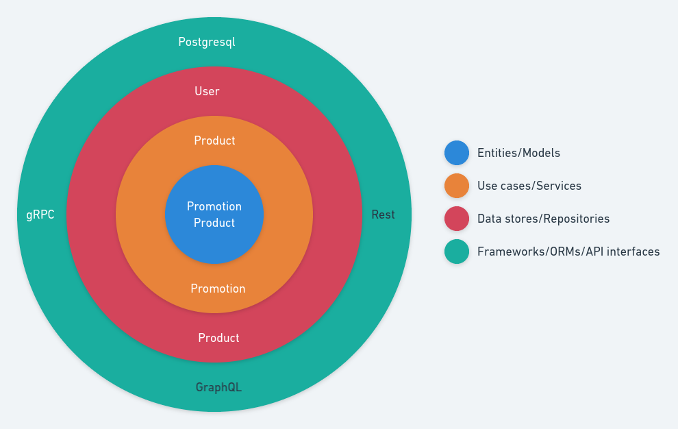

# Product service

Product listing for your ecommerce store.

The figure below depicts how the solution was architected:

[](./docs/img/architecture.png)

and below how the source code was structured:

```
.
├── api
├── cmd
├── entity
├── grpc
├── mocks
├── postgresql
├── product.go
└── usecase
```

* `api`: gRPC protocol definition.
* `cmd`: Command line interfaces like daemons and clients.
* `entity`: Internal only data structure representation.
* `grpc`: gRPC generate stubs and server implementation.
* `postgresql`: Postgresql data store implementation.
* `product.go`: Interfaces definitions.
* `usecase`: Use cases implementations.

The main reason for this is to build a solution to middle-to-long tream.

## Requirements

* Golang
* Postgresql

## Local development

Clone:
```
git clone https://github.com/wiliamsouza/product.git

```
The recomended way to get it is through https://github.com/wiliamsouza/maketplace

Install dependencies:
```bash
make deps
```
Build binaries:
```bash
make build
```
This will build two commands:

* productctl: Command line interface.
* productd: Start gRPC and HTTP servers.

Generated in `dist` folder for Linux and Mac.

Each command has it own help:
```
$ dist/productd_linux_amd64/productd 
Product is a gRPC and HTTP service daemons that implements products listings.

Usage:
  productd [command]

Available Commands:
  help        Help about any command
  serve       Start http or grpc daemons
  version     Print version

Flags:
      --config string   config file (default is $HOME/.product.yaml)
  -h, --help            help for productd

Use "productd [command] --help" for more information about a command.
```
and:
```
$ dist/productctl_linux_amd64/productctl 
Productctl is a client for product gRPC service that implements products listings.

Usage:
  productctl [command]

Available Commands:
  client      Interact with product gRPC server
  help        Help about any command
  version     Print version

Flags:
      --config string   config file (default is $HOME/.product.yaml)
  -h, --help            help for productctl

Use "productctl [command] --help" for more information about a command.
```
## Testing
```bash
make test
```
Before run tests start database:
```
docker-compose up
```
## Makefile

Run `make` to see help.
```
help                           Show Help
security                       Run security code checks
typping                        Run static type checker
lint                           Run lint
check                          Run pylint, mypy and bandit
test                           Run tests
```
## Database

First install https://github.com/golang-migrate/migrate/tree/master/cmd/migrate

This command bellow will create `product` table.
```bash
make migrate
```
Before run migrate start database:
```
docker-compose up
```
## Docker

Build:
```bash
docker build -t wiliam.dev/product .
```
Run:
```bash
docker run --rm wiliam.dev/product
```
